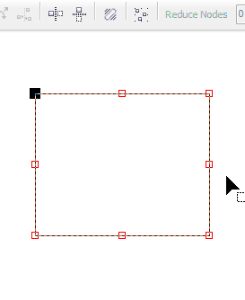
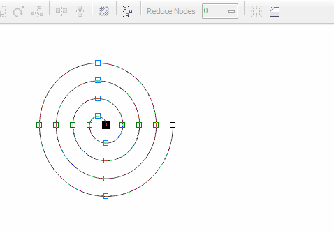

# Зеркальное редактирование узлов и гибкий режим в CorelDRAW

Продолжаем рассматривать инструмент **Shape**. На этот раз я расскажу про зеркальное редактирование узлов и про гибкий режим. Для этих функций, на панели свойств инструмента Shape, предусмотрено три кнопки: **Reflect nodes horizontally**, **Reflect nodes vertically** и **Elastic mode**.

## Зеркальное редактирование узлов

Использовать эту возможность очень просто — необходимо выделить два узла (или больше), и активировать одну из двух кнопок, или обе сразу, в зависимости от того, какой результат вы хотите получить.

_Сразу хочу отметить, что в Х5 выделять узлы нужно именно с зажатой клавишой Shift, т.к. при выделении узлов рамкой, кнопки не будут доступны._

## Гибкий режим

Тут ещё проще — выделяем необходимые узлы, активируем гибкий режим и тянем за один из узлов. В зависимости от того, за какой именно узел потянуть, может получиться разный результат. Что именно происходит с кривой в этом режиме, наглядно видно на спирали:

_После того как необходимое редактирование кривой было выполнено, советую выключать гибкий режим._