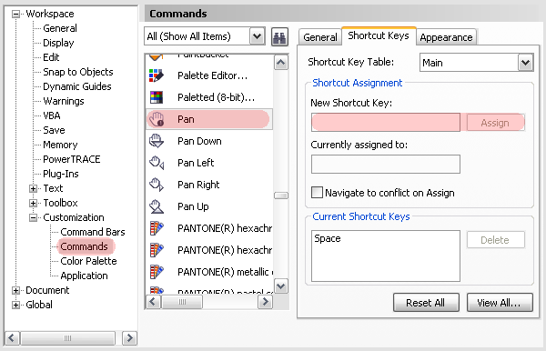

# Навигация по документу «пробелом», как в Photoshop

_Дата публикации: 02.11.2012_

Помимо стандартных, описанных во всех учебниках по CorelDRAW, возможностей навигации по документу, существует ещё один способ. Работает он почти так же как в Photoshop, но не совсем – команда переключает CorelDRAW в режим **Pan** и после однократного применения возвращается к предыдущему инструменту. Пробел удерживать не нужно!  

**Настраиваем:** открываем настройки CorelDRAW (меню Tools > Customization > Commands), в выпадающем списке сверху выбираем All (Show All Items), в списке ниже находим команду **Pan** и назначаем ей клавишу **Пробел**.  

Хочу обратить внимание, что по умолчанию эта клавиша назначена на переключение с активного инструмента на **Pick tool**. Однако для этого у нас ещё останется **Ctrl + пробел**.
