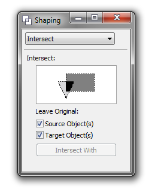

# Объединение, пересечение, и другие функции формирования объектов

Зачастую многие формы строятся на основе примитивов, таких как прямоугольник и овал. Однако, чтобы из нескольких примитивов получить более сложную форму, необходимо использовать функции объединения, пересечения и т.д. В графическом редакторе **CorelDRAW** предусмотрено большое количество функций и инструментов формирования (изменения формы) кривых, примитивов и прочих объектов. В этой заметке я расскажу про функции объединения, исключения, пересечения и прочие родственные им операции, без которых трудно представить профессиональную работу с объектами в **CorelDRAW**.

Как и в большинстве случаев, CorelDRAW предоставляет несколько способов использования функций формирования, в данном случае два:

1. быстрый, в виде кнопок на панели свойств
2. расширенный, в виде докера

## Рассмотрим первый способ

Данные кнопки появятся на панели свойств в том случае, если выделено два и более объекта, например, несколько примитивных форм, таких как прямоугольник и овал.

Список функций формирования доступный на панели свойств:

*   **Weld** (Объединение) — объединить объекты в одну кривую с общей заливкой и абрисом
*   **Trim** (Подгонка) — вырезать часть объекта по форме другого объекта
*   **Intersect** (Пересечение) — создать объект из области, в которой есть наложение двух или нескольких объектов
*   **Simplify** (Упрощение) — подгонка накладывающихся областей объектов
*   **Front minus back** (Передние минус задние) — удалить фоновый объект из основного объекта
*   **Back minus front** (Задние минус передние) — удалить основной объект из фонового объекта
*   **Create boundary** (Создать границу) — создать новый объект, окружающий выбранные объекты

Результат работы некоторых функций, таких как Trim, зависит от очерёдности выделения объектов.

_На заметку: По умолчанию на панели представлены не все команды. Дополнительные (например, Weld Target) можно найти и вытащить на панель в разделе Customization > Commands > Arrange окна настроек программы (Ctrl+J)._

## Второй способ

Использование докера **Shaping** (формирования) даёт несколько простых преимуществ. Во-первых, если вы ещё не особо разобрались, что какая функция делает, докер наглядно подскажет. Во-вторых, при использовании некоторых функций, можно управлять какие объекты после применения останутся, а какие будут удалены. Ну и в отличие от панели свойств, которая меняет своё «наполнение» автоматически в зависимости от выбранных объектов, докер всегда доступен.
