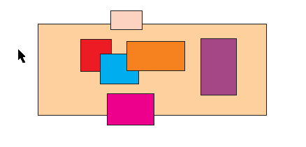

# Перемещение рамки выделения

Редактор CorelDRAW богат на различные мелкие но очень приятные фишки. Достаточно вспомнить о таких полезностях, как копировании свойств объекта с помощью перетаскивания правой кнопкой мыши, или дублирования объекта с помощью всё той же правой кнопки, во время перетаскивания левой. Обо всём этом и многом другом написано в материале "Всё об инструменте Указатель". Однако, там не упоминается об ещё одной фишке — интерактивном перемещении рамки выделения.

Работает эта функция очень просто — начав рисовать рамку выделения инструментом **Pick tool**, необходимо не отпуская левой кнопки мыши, нажать и удерживать правую. Пока вы удерживаете обе кнопки, можно перемещать рамку выделения. Отпустив правую кнопку, можно подкорректировать размер рамки.
