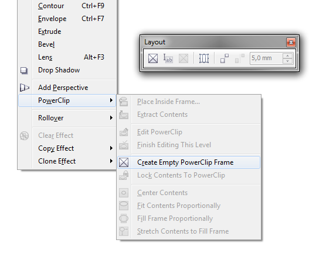
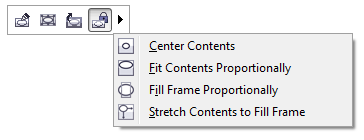
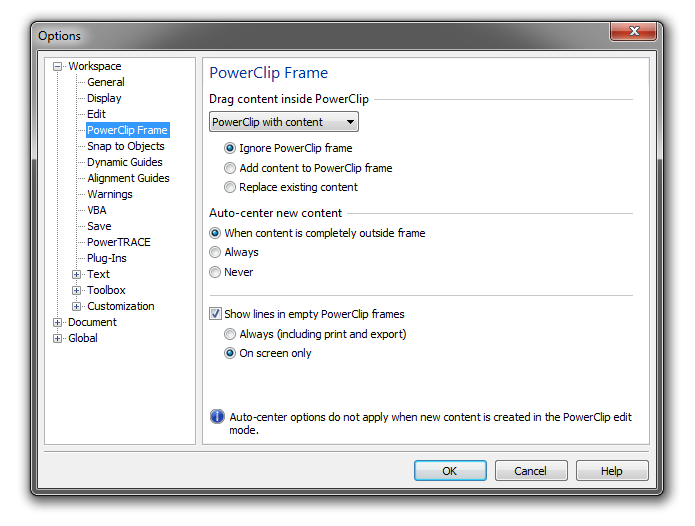

# PowerClip в CorelDRAW X6

PowerClip — это, пожалуй, один из самых известных и часто используемых эффектов **графического редактора CorelDRAW**. Но даже при всей его известности, далеко не все используют этот эффект по максимуму. В этом материале я постараюсь рассказать про все особенности PowerClip, что нового в **CorelDRAW X6.1**, и как этим пользоваться.

По сути, **PowerClip** — эффект, который позволяет использовать объект как контейнер (фрейм) для размещения внутри него других объектов.

## Создание эффекта PowerClip

Для преобразования объекта в контейнер подойдут кривые, примитивы и текст. Зачастую, CorelDRAW предоставляет несколько вариантов достижения одного и того же результата, и создание эффекта PowerClip не исключение:

1.  В контекстном меню помещаемого объекта выбрать пункт **PowerClip Inside** (Поместить в контейнер) или, выбрав помещаемый объект, вызвать команду **Place Inside Frame** (Поместить во фрейм) в меню Effects > PowerClip (Эффекты > PowerClip) (в последствии «основное меню»), после чего нужно выбрать объект который будет использоваться в качестве контейнера.
2.  Удерживая правой кнопкой мыши помещаемый объект, перетащить его на объект который будет использоваться в качестве контейнера (при этом курсор поменяется на прицел) и отпустить кнопку. В появившемся контекстном меню выберите **PowerClip Inside** (Поместить в контейнер).
3.  Заранее изменить **Frame Type** (Тип фрейма) на **PowerClip Frame** (фрейм PowerClip). Сделать это можно всё в том же основном меню, в контекстном меню объекта, или с помощью кнопки **PowerClip frame** (Фрейм PowerClip) на панели Layout (Макет).

Третий вариант доступен в CorelDRAW начиная с версии Х6\. Именно в ней разработчики закрепили такое понятие как «Фрейм», которое давно широко используется в других редакторах больше направленных на вёрстку.

Добавлять объекты в уже существующий фрейм PowerClip можно как первым, так и вторым способом из перечисленных выше. А в 16-й версии редактора CorelDRAW была добавлена возможность интерактивного помещения объектов внутрь фрейма посредством простого перетаскивания объекта левой кнопкой мыши на фрейм. В случае если фрейм пуст, объект автоматически помещается внутрь него. Что бы игнорировать пустой фрейм, нужно удерживать клавишу **F**. В случае же если в фрейме уже содержатся какие либо объекты, по умолчанию он игнорируется, однако если удерживать клавишу **W**, объект добавится в контейнер, а если удерживать **K**, содержимое фрейма заменится на перемещаемый объект. Значения по умолчанию в обоих этих случаях, и многое другое, можно настроить, но об этом ниже.

## Редактирование фрейма PowerClip и его содержимого

Внешне, фрейм можно редактировать как обычный объект, изменять его размеры, форму, позицию и т.д. При этом, по умолчанию, его содержимое масштабируется и перемещается вместе с ним. За такое поведение отвечает опция **Lock Contents to PowerClip** (Заблокировать содержимое в PowerClip), которую можно найти в основном и контекстном меню, а также на новой плавающей панели. Соответственно, если выключить эту опцию все внешние изменения будут касаться только самого фрейма, при этом его содержимое будет оставаться неизменным.

_К слову о новой плавающей панели, которая появилась в Х6\. Это лишь ещё один дополнительный способ для быстрого доступа к самым частым операциям связанным с PowerClip._

Редактировать содержимое PowerClip можно как «изнутри», так и «снаружи» (начиная с X6). Первый вариант больше подходит для удобной работы с объектами внутри фрейма, а второй больше предусмотрен для редактирования содержимого в целом.

**Режим редактирования** позволяет «войти» внутрь фрейма и изменять его содержимое отдельно от «внешних» объектов. Удачным дополнением в Х6 стало то, что в этом режиме внешние объекты не скрываются полностью, а остаются слегка заметными, что существенно упрощает макетирование благодаря восприятию макета в целом. Войти в этот режим можно опять же несколькими способами:

*   Командой **Edit PowerClip** (Редактировать PowerClip) которая доступна в основном меню, контекстном меню или на плавающей панели;
*   Кликом левой кнопкой мыши по фрейму с зажатой клавишей Ctrl;
*   Двойным кликом по фрему.

Список вариантов выхода несколько отличается:

*   Команды **Finish Editing This Level** (Завершить редактирование) в основном меню;
*   Команды **Stop Editing Content** (Завершить редактирование содержимого) на плавающей панели;
*   Кликом левой кнопкой мыши по пустому полю с зажатой клавишей Ctrl.

_Хочу также обратить внимание на то, что начиная с Х6 закрыть документ можно даже находясь в режиме редактирования содержимого фрейма, что было невозможно в предыдущих версиях CorelDRAW._

Внешнее редактирование содержимого фрейма несколько проще. Содержимое можно выделить с помощью команды **Select PowerClip Contents** (Выбрать содержимое PowerClip). Этот вариант удобен для коррекции позиции или масштаба содержимого в целом. Или же выделять объекты фрейма по отдельности, для индивидуальной правки, с помощью левой кнопки мыши удерживая клавишу Alt.

Отдельно стоит рассмотреть команды подгонки содержимого, которые доступны как в основном и контекстном меню, так и в выпадающем меню плавающей панели:

*   **Center Contents** (Центрировать содержимое) — располагает содержимое по центру относительно фрейма;
*   **Fit contents proportionally** (Подогнать содержимое пропорционально) — изменяет масштаб содержимого таким образом, что бы оно максимально заполняло фрейм и при этом было полностью доступно;
*   **Fill frame proportionally** (Растянуть содержимое пропорционально, чтобы заполнить фрейм) — изменяет масштаб содержимого таким образом, что бы максимально заполнить фрейм, при этом часть содержимого может скрыться за пределами фрейма;
*   **Stretch contents to fill frame** (Растянуть содержимое, чтобы заполнить фрейм) — изменяет масштаб содержимого таким образом, что бы максимально заполнить фрейм, при этом пропорции содержимого могут исказиться.

## Удаление и извлечение содержимого фрейма

В 16-й версии CorelDRAW стало значительно проще удалить содержимое фрейма, для этого нужно изменить тип фрейма на **None** (Нет) в контекстном меню объекта или на панели **Layout** (Макет). А для извлечения содержимого предусмотрена команда **Extract Contents** (Извлечь содержимое) которая доступна в основном и контекстном меню, а также в виде кнопки на плавающей панели. Стоит отметить что в Х6, даже после извлечения всего содержимого фрейм остаётся фреймом.

## Настройки PowerClip

В новой версии CorelDRAW настройки PowerClip были выделены на отдельную «страницу» **PowerClip Frame** (Контейнер PowerClip), которую можно найти в настройках Tools > Options > Workspace (Инструменты > Параметры > Рабочее пространство).

С помощью этих настроек можно изменить поведение по умолчанию для функции интерактивного помещения объекта во фрейм, как в случае с пустым фреймом, так и с уже содержащим какие либо объекты. Добавилась опция автоматического центрирования объекта при добавлении во фрейм, если он изначально находился за пределами фрейма (работает только для первого варианта добавления объекта). А также настроить поведение линий, которыми помечаются пустые фреймы (Х), или вообще отключить их.

## В качестве заключения

Далеко не все нововведения связанные с PowerClip могут понравиться пользователям, однако стоит исключить привычку и взглянуть на работу с фреймами по новому. Как только вы это сделаете, новые функции и особенности окажутся весьма полезными.

## Полезно знать

Если необходимо «разбить» макет или фотографию на несколько кусочков по типу пазлов, нарисуйте и сгруппируйте векторные кусочки, а затем пометите в эту группу изображение или макет используя команду **PowerClip Inside** (Поместить в контейнер). В последствии группу можно разгруппировать.

Для более тонкой настройки PowerClip, можно воспользоваться утилитой **CDRtuning**.
