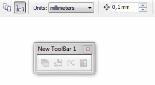

# Быстрая настройка интерфейса CorelDRAW

_Дата публикации: 09.01.2011_

Я уже не раз затрагивал тему настройки интерфейса и приводил некоторые примеры, как улучшить стандартные панели инструментов. В этот раз я расскажу о быстрой настройке интерфейса. Заключается она в том, что Вам не нужно открывать окно настроек. Всё делается «на ходу».

Сразу хочу отметить, что данный способ настройки подходит лишь для перемещения, дублирования или удаления тех команд, которые уже находятся на одной из открытых панелей или в меню.

Итак, всё очень просто! Для того что бы переместить команду в другое место, достаточно нажать и удерживать клавишу **Alt**, затем схватить нашу команду и перетащить её на новое место. Alt нам нужен лишь для того, что бы «выдрать» команду со своего места. То есть удерживать его на протяжении всего этапа перетаскивания нет необходимости. Если в процессе перетаскивания, нажать и удерживать **Ctrl**, мы можем дублировать команду.

Если таким способом перетащить команду в рабочую область, будет создана новая панель с этой командой.
