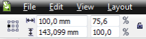

# Быстрая смена точки отсчёта

Те кто из Вас работал или работает в InDesign или Illustrator, хорошо знакомы с возможностью быстро менять **точку отсчёта**, для того что бы изменять размер относительно определённого угла/стороны. Такая же возможность существует и в CorelDRAW, однако она не особо удобна из за того что располагается в докере трансформации. Но, как оказалось, смену угла отсчёта можно легко вытащить на панель инструментов.

Для этого Вам потребуется CorelDRAW Х5 с установленным вторым пакетом обновлений (билд 661). Итак, открываем настройки _Tools > Options > Customization > Commands_, жмём иконку бинокля и в появившееся окно поиска вводим _Object Origin_. Найденную команду вытаскиваем на панель трансформации и закрываем окно настроек кнопкой ОК.

Вот и весь секрет!
