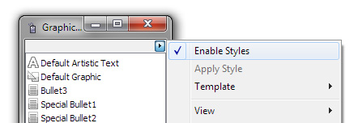

# Интерактивные настройки

_Дата публикации: 02.11.2012_

Все мы знаем, что **CorelDRAW** имеет настройки по умолчанию, такие как цвет заливки, обводки, шрифт и т.д., которые применяются для вновь созданных объектов. С одной стороны это удобно! Однако, может понадобиться что бы CorelDRAW действовал более гибко и помнил последние использовавшиеся настройки, на подобие как действует Illustrator.  

Для этого достаточно открыть докер Graphic and Text Styles (Ctrl+F5) и в контекстном меню снять галочку с пункта Enable Styles.  

