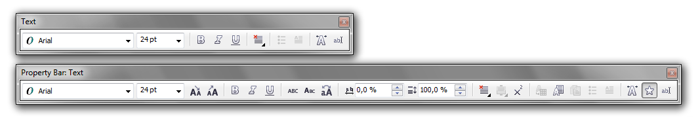
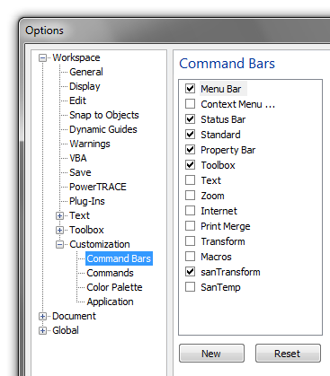
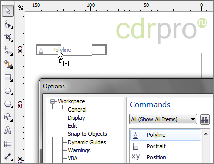
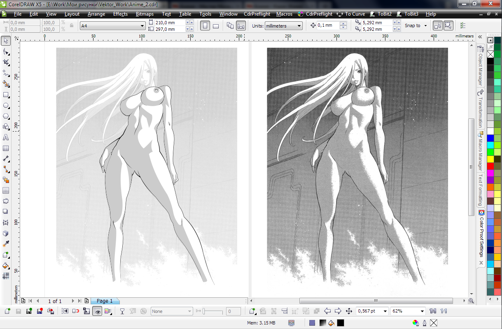
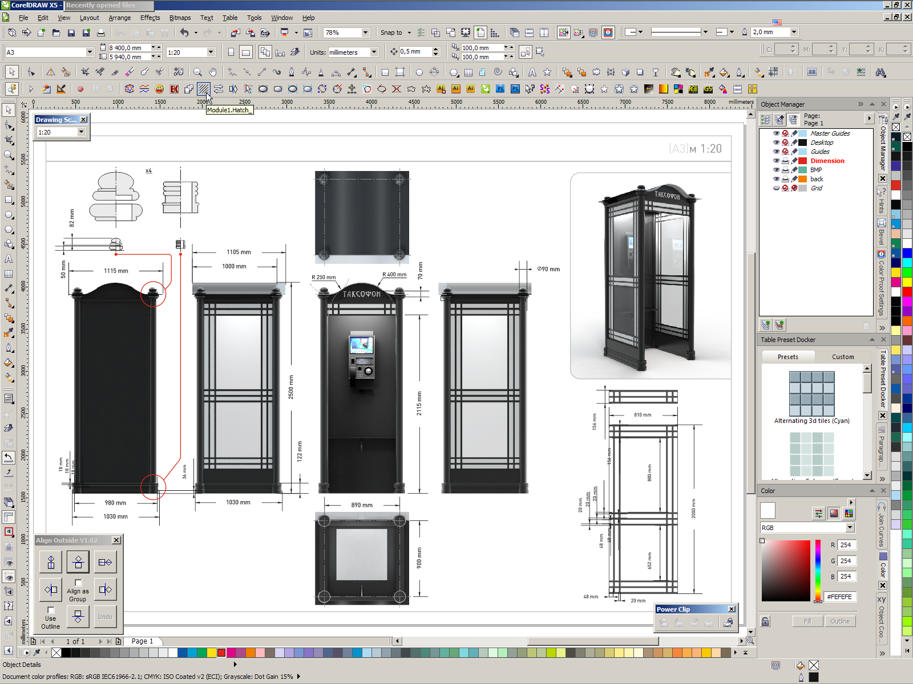
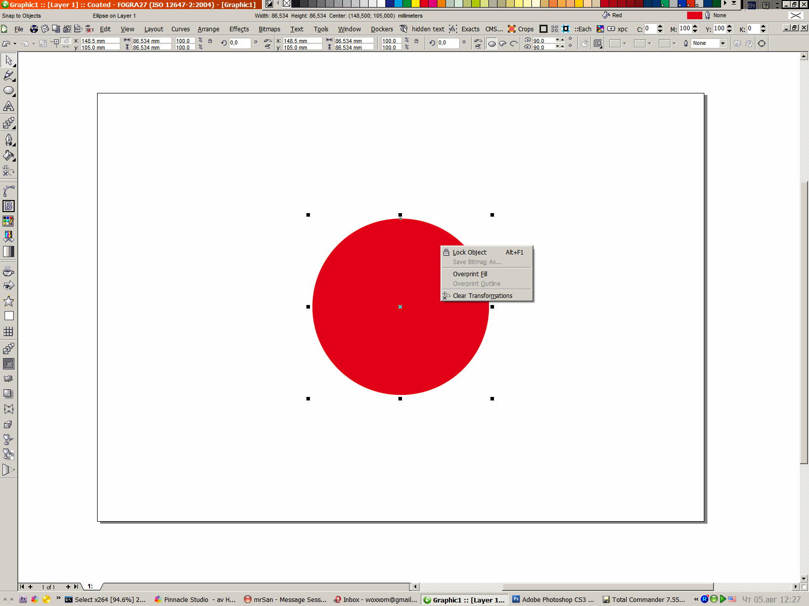
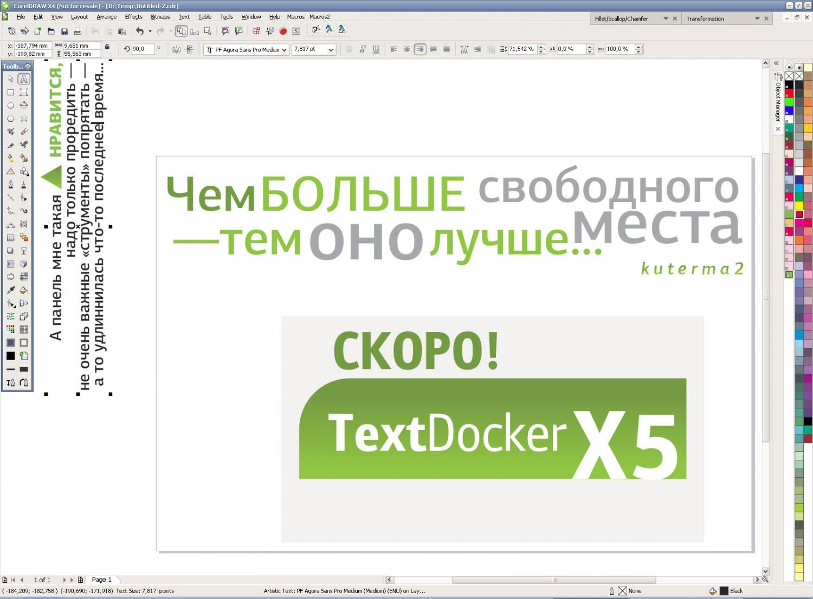

# Настройка интерфейса CorelDRAW

_Дата публикации: 08.08.2010_

Качественная и быстрая работа – это, прежде всего удобный «инструмент». К тому же, любая работа накладывает свой отпечаток на процесс, определяя какие команды Вы используете чаще, а какие реже. Некоторые команды и вовсе спрятаны в «глубинах» **настроек CorelDRAW**, так что о них многие и не догадываются. Из вышесказанного следует логичный вывод – что бы работать было удобнее, и рутинные действия протекали быстрее, необходимо настроить интерфейс программы под свои нужды.

Для примера, на изображении ниже наглядно видно как выглядит **панель для управления текстом** по умолчанию, и что из неё можно сделать, потратив немного времени.

Для начала нужно определиться с терминологией:

* **Command Bar** (панель инструментов) – панель, на которой находятся определённые кнопки и элементы управления. Наглядный пример – панель инструментов (ToolBox). Как ни странно, но меню тоже входит в число панелей инструментов.
* **Commands** (команды) – кнопки вызова функций, инструментов и т.д.

## Управление панелями

Для управления панелями нам нужно открыть настройки программы – **меню Tools** > Options (Ctrl + J) > Workspace > Customization > **Command Bars**. В списке справа находятся все панели, которые присутствуют в программе. Галочками отмечены активные панели (отображаются в данный момент на экране). Под списком находятся две кнопки, с помощью которых можно создать новую, или удалить любую из существующих панелей. Справа от списка располагается набор настроек, с помощью которого можно изменить некоторые свойства выделенной панели, а так же пара глобальных параметров в блоке **Other**.

При выделении некоторых стандартных панелей, становятся доступны дополнительные опции.

## Команды

Команды, как вы уже наверное поняли, находятся в **настройках CorelDRAW** по соседству с **Command Bars**. Они разделены на категории, которые доступны в выпадающем списке над списком команд. Рядом расположена кнопка поиска.

Для того что бы **добавить** какую то команду на одну из панелей, достаточно найти её в списке, «схватить» и удерживая левую кнопку перетащить на нужное место. При этом действии курсор примет вид стрелки со знаком «+», а чёрной разделительной линией будет указано то место, куда «упадёт» команда. Если же перетащить команду на пустое рабочее поле, то автоматически будет создана новая панель инструментов, в которой будет одна кнопка.

Для того что бы **удалить** команду, достаточно выделить её на панели и перетащить на рабочее поле. При этом курсор примет вид  стрелки со знаком «Х».

Некоторые команды не отображаются в **списке Commands**, например **Unsharp Mask**. Для того что бы их скопировать из меню на какую либо панель, необходимо открыть **раздел Commands** в настройках программы, затем найти нужную команду в меню программы, «схватить» её и перетащить на нужную панель **удерживая Ctrl**. При этом курсор примет вид указателя со знаком «+», так же как и при вытаскивании кнопок из окна настроек.

## Настройки команд

Логично, что настраивать можно не только панели и расположение команд. Каждая команда имеет свой набор свойств: название (Caption), всплывающая подсказка (Tooltip help), иконки (Image), а так же горячие клавиши (Shortcut keys).

## Примеры

## Полезно знать

В **15-й версии CorelDRAW** все панели по умолчанию заблокированы. Для того что бы их разблокировать, достаточно правой кнопкой мыши кликнуть на любой из них, и в выпадающем меню снять галочку с пункта **Lock ToolBars**.

Для того что бы настроить контекстные меню, сначала необходимо в настройках Command Bars поставить галочку напротив пункта **Context Menu…**, перейти в раздел Commands, и только после этого можно добавлять/удалять команды.

В CorelDRAW есть **скрытые команды**. До некоторых из них можно добраться, прибегая к определённым хитростям, как в случае с [Background Tasks](../raspolozhenie-background-tasks/index.md). До других – только редактируя исходный файл рабочей среды. Например, для управления интерактивным выключением прилипания (Snap). Сколько ещё таких недокументированных возможностей, известно, пожалуй, только лишь разработчикам.
