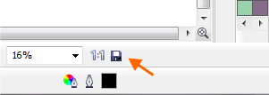

# Настройка расположения иконки Background Tasks

_Дата публикации: 25.07.2010_

Я уже писал о том, что благодаря поддержке многоядерных процессоров, **CorelDRAW X5** совершает такие операции как Сохранение и Печать в фоновом режиме. Тем самым Вы можете, не дожидаясь окончания процесса, продолжать работать. Сам процесс отображается в виде небольшой иконки **Background Tasks** на панели состояния (Status Bar). Эта иконка меняется в зависимости от типа процесса. Например, для сохранения это дискетка, а для печати – принтер. Но не всем может понравиться её расположение.

Казалось бы, куда проще зайти в настройки кнопок, найти этот самый Background Tasks и перетащить, куда нам нужно, но не тут-то было. Этой иконки там нет! И что делать, спросите Вы. Доставать шаманский бубен.

Итак, описываю процесс:

1. Создаём в CorelDRAW X5 новый файл.
2. Импортируем в него примерно 3-5 растровых изображений, каждое из которых должно быть примерно по 10Мб. Параметры я озвучил весьма условно. Суть в том, что бы процесс сохранения занял, хотя бы 15-20 сек., или даже меньше.
3. Выбираем команду сохранить файл.

Как только появится иконка фонового сохранения, открываем настройки клавиш (**Customization > Commands**), «хватаем» её мышкой и тащим куда нам нужно. В этот момент нужно быть аккуратным, что бы случайно не удалить её. Вот и всё! На скриншоте ниже видно пример результата «трудов».

Кстати говоря, по умолчанию иконка находится на панели состояния (Status Bar), рядом с цветом заливки.
