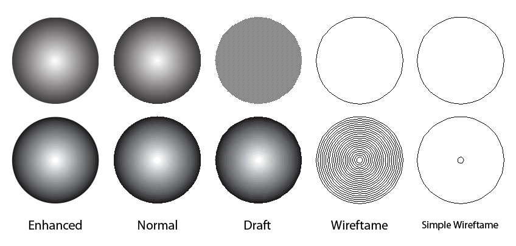

# Режимы просмотра документа

_Дата публикации: 25.05.2010_

Изначально режимы просмотра влияли лишь на качество отображения документа. С выходом **CorelDRAW X5**, ситуация немного изменилась. Но прежде чем хвататься за новое, стоит лучше присмотреться к старому. Так что для начала я расскажу о ставших уже классическими режимах отображения документа, и только потом о режиме Pixels, наложениях и т.д.

На первый взгляд может показаться, что единственно верным решением будет выбор наилучшего отображения. Однако это не всегда целесообразно, даже если у вас мощный процессор и много оперативной памяти. Итак, для того что бы разобраться какой режим когда использовать, я расскажу по порядку обо всех. Команды, управляющие режимами просмотра, по умолчанию располагаются в меню **View** (Вид).

## Enhanced (Расширенный)

По умолчанию документы отображаются в расширенном режиме. Он служит для отображения изображения с максимальным качеством. При этом векторные объекты сглаживаются, видно заливки PostScript, растровые изображения отображаются с максимальным качеством и т.д.

## Normal (Обычный)

На сегодняшний день этот режим уместно использовать только на сложных макетах, в которых использование режима Enhanced приводит к замедленной прорисовке. Такие макеты довольно редкое явление, но всё же имеют место быть. В этом режиме отключено сглаживание объектов, что существенно увеличивает скорость прорисовки.

## Draft (Черновой)

В этом режиме градиентные заливки отображаются усреднённым цветом. Растровые изображения отображаются с низким разрешением.

## Wireframe (Каркас)

Этот режим предназначен для отображения документа в режиме каркаса. То есть, в этом режиме вы не увидите ни цвета заливки, ни обводку. Растровые изображения отображаются оттенками серого цвета с полупрозрачностью. Всё вышесказанное для этого режима, так же актуально и для **Simple Wireframe** (Упрощённый каркас). Однако есть отличия. Например, в Simple Wireframe не отображаются ступени таких эффектов, как Blend (перетекание) и Contour (контур).  
Отмечу, что оба эти режима незаменимы при подготовке макета для плотерной резки.

Рассмотрев все, как я их образно обозвал, классические режимы отображения, можно спокойно перейти к новинкам. Сразу замечу, что опция **Simulate Overprints** (Моделировать наложение), является заменой режима **Enhanced with Overprints** (Расширенный с наложениями) присутствующим в 14 версии продукта. Активна она только тогда, когда выбран режим Enhanced или Pixels. Отвечает она за отображение документа, приближенное к готовому печатному продукту. Обращаю Ваше внимание, что в это понятие входит не только просмотр наложений красок (overprint) и режимов наложения прозрачностей, но и просмотр эффектов в цветовом пространстве CMYK, так как обычно они отображаются в RGB. К этим эффектам так же относятся и градиентные заливки.

## Pixels (Пиксели)

Этот режим является одним из новшеств CorelDRAW X5, и о нём, я уже вкратце рассказывал в общем обзоре новинок. Как уже наверное понятно из названия, этот режим отображает документ так, как он будет выглядеть после экспорта в любой из растровых форматов (без потерь качества). Предназначен он в основном для работы с web графикой, а так же для создания иконок или интерфейсов.

Ещё одним новшеством X5, является опция **Rasterize Complex Effects** (Растрировать сложные эффекты), которая предназначена для предварительного просмотра того, как будут растрированы сложные эффекты документа при печати, такие как прозрачности и тени. Не скажу, что эту опцию можно назвать очень полезной, однако кто-то может найти её весьма удобной.

Ну и как всегда, если есть что добавить, не стесняемся :)

## Полезно знать

Переключатся между двумя последними использовавшимися режимами просмотра можно с помощью сочетания **Shift + F9**.

Для режима Enhanced предусмотрены две настройки:

1. Show PostScript fills in enhanced view (Показывать PostScript-заливки в качественном режиме)  
2. Antialias bitmaps in enhanced view (Устранить наложения спектров в качественном режиме). Говоря простым языком, эта опция включает дополнительное смазывание для растровых изображений. Найти их можно в настройках (Ctrl + J) > Workspace (Рабочее пространство) > Display (Монитор).
