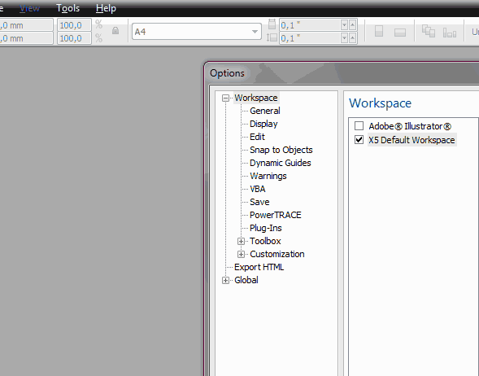

# Улучшаем доступ к списку последних документов

В этом уроке речь пойдёт о небольшом улучшении доступа к списку последних документов, используя только стандартные средства программы CorelDRAW. А улучшение это будет заключаться в более удачном расположении списка, для более быстрого доступа.

Конечно стандартный список обладает рядом недостатков. Например, в него запоминаются только 15 последних документов. Так же не видно превью файлов. Однако о функционале программы нужно судить исходя из рабочих потребностей. И если для Вас отсутствие превью и небольшое число последних документов не являются недостатками, тогда читаем дальше. В противном случае, используйте [макрос RecentFiles](http://cdrpro.ru/macros/).

Итак, главным минусом списка является его положение в меню — практически в самом низу меню File. Конечно его можно было бы поднять, но есть более удачное, на мой взгляд, место для этого списка — контекстное меню рабочей области, которое вызывается кликом правой кнопки на пустом месте в окне CorelDRAW.

Итак, приступаем к выполнению задачи — переносу списка в контекстное меню.

_Примечание: в этом видео список находится вверху меню File._
